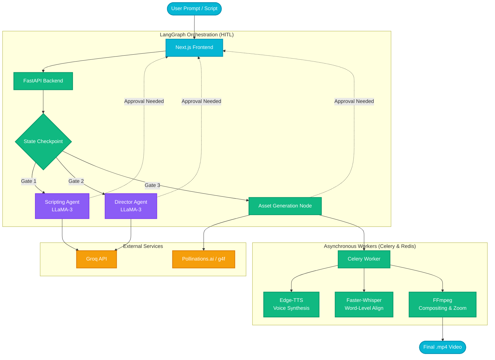

# 🎬 NeuroCut - Enterprise Multi-Agent Short-Form Video Studio

<div align="center">
  <p><strong>Transform simple text prompts into fully produced short-form videos automatically using a Zero-Cost AI Multi-Agent Architecture.</strong></p>
</div>

---

## 🚀 Overview

**NeuroCut** is a state-of-the-art AI-powered platform designed to automate the video production pipeline. It acts as an entire production studio—complete with a scriptwriter, a director, an asset generator, and a video editor—cooperating seamlessly through a **Human-In-The-Loop (HITL)** LangGraph orchestration workflow.

We built NeuroCut to drastically lower the barrier to entry for content creators, agencies, and enterprises by relying on **Zero-Cost and Open-Source** APIs.

### Key Features
- **✨ AI Script Generation:** Instantly turns raw concepts into engaging short-form scripts optimized for retention.
- **🎬 AI Storyboarding & Direction:** Automatically calculates pacing, visual cues, and virtual camera movements (Ken Burns effects).
- **🖼️ Zero-Cost Image Generation:** Proxies through `g4f` and `Pollinations.ai` to dynamically generate high-quality visual frames.
- **🗣️ Automated Voiceovers:** Uses `edge-tts` to generate crisp, natural-sounding voiceovers.
- **⏱️ Local Word-Level Timestamps:** Employs `faster-whisper` running locally to precisely align audio with dynamic subtitles without relying on expensive paid APIs.
- **🛑 Human-In-The-Loop (HITL):** Complete transparency. The system pauses at specific gates (Scripting, Storyboarding, Asset Forging) allowing users to edit and approve the AI's work before moving forward.

---

## 🏗️ Architecture Flowchart



---

## 🛠️ Tech Stack

Our stack is deeply optimized for local execution and zero API costs:

### Frontend
- **Next.js 14 & React:** For a highly responsive, app-like user interface.
- **Tailwind CSS & Framer Motion:** For a sleek, "glassmorphism" inspired cyberpunk aesthetic with smooth micro-animations.
- **Lucide React:** Iconography.

### Backend
- **FastAPI (Python):** High-performance backend routing and logic handling.
- **LangGraph:** Orchestrates the complex multi-agent state machine.
- **Redis & Celery:** Handles background video rendering jobs and state checkpointing for HITL pauses.
- **FFmpeg (`ffmpeg-python`):** The engine that stitches images, applies camera panning, and overlays subtitles.

### AI Models & Services
- **LLM Engine:** LLaMA-3 (via Groq for lightning-fast inference).
- **Image Synthesis:** `g4f` (Flux / Midjourney proxies) & `pollinations.ai`.
- **Audio Processing:** `edge-tts` + `faster-whisper`.
- **Content Moderation:** Microsoft Azure Content Safety protocols.

---

## ⚙️ Getting Started

### Prerequisites
- Python 3.10+
- Node.js 18+
- Redis (Running locally on port `6379`)
- FFmpeg (Installed and added to your system PATH)

### 1. Backend Setup

1. Navigate to the backend directory:
   ```bash
   cd backend
   ```
2. Create and activate a virtual environment:
   ```bash
   python -m venv .venv
   source .venv/bin/activate  # On Windows: .venv\Scripts\activate
   ```
3. Install dependencies:
   ```bash
   pip install -r requirements.txt
   ```
4. Set up your environment variables:
   Copy `.env.example` to `.env` and add your Groq API key:
   ```bash
   GROQ_API_KEY=your_groq_key_here
   REDIS_URL=redis://localhost:6379/0
   ```
5. Start the Celery worker (in a separate terminal):
   ```bash
   celery -A worker.celery_app worker --loglevel=info
   ```
6. Start the FastAPI server:
   ```bash
   uvicorn main:app --port 8000 --reload
   ```

### 2. Frontend Setup

1. Navigate to the frontend directory:
   ```bash
   cd frontend
   ```
2. Install Node modules:
   ```bash
   npm install
   ```
3. Start the Next.js development server:
   ```bash
   npm run dev
   ```
4. Open [http://localhost:3000](http://localhost:3000) in your browser.

---

## 🛣️ Pipeline Workflow

1. **Ingestion:** Provide a raw prompt or an article to the system.
2. **Scripting (Gate 1):** The Scripting Agent generates an engaging hook and narrative. The system pauses for your approval.
3. **Storyboarding (Gate 2):** The Director Agent breaks the script down into timestamped scenes, specifying camera movements and style prompts.
4. **Asset Forging (Gate 3):** The backend generates placeholder or real images for each scene. You can override specific frame prompts and regenerate them.
5. **Synthesis:** FFmpeg and Edge-TTS compile the assets into a final `.mp4` video with synchronized subtitles.

---

## 🤝 Contributing

Contributions are welcome! Please feel free to submit a Pull Request if you have ideas on how to optimize the FFmpeg rendering pipeline, add new agentic capabilities, or improve the zero-cost architecture.

## 📄 License

This project is licensed under the MIT License.